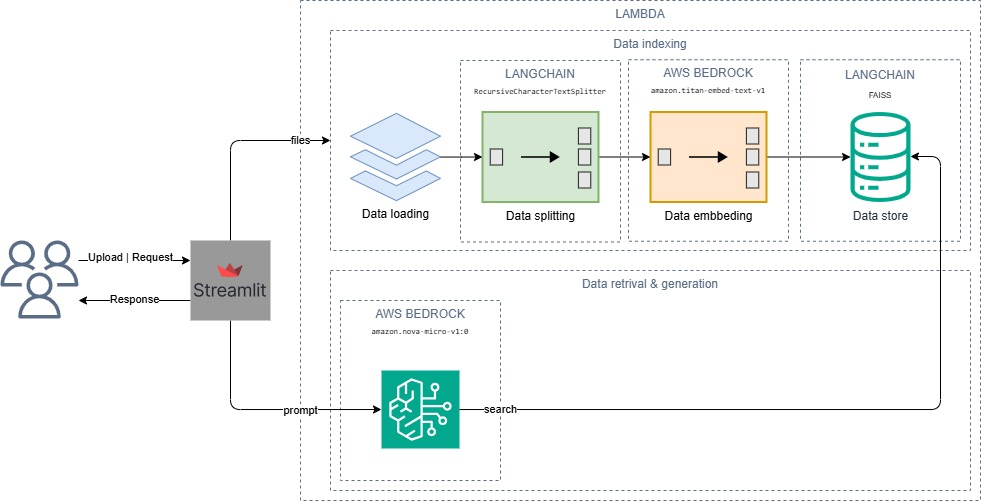

# Exam simulator

O projeto consiste em uma arquitetura RAG com IA utilizando recursos da AWS.

## Aquitetura


## Pré requisito
1. conta AWS
2. IDE para desenvolver, VScode
3. vscode configurado com a AWS
4. modelos de dados liberados na AWS
5. conhecimento em python

## V1.1 - Apresentação
- Vídeo 1
    - Apresentação
    - Configuração virtual
    - desenvolvimento do back
    - teste do back
- Vídeo 2
    - desenvolvimento do front
    - teste do front
- Vídeo 3
    - extra, multiplas extensions
    - alteração no back
    - alteração no front
    - remover o arquivo temporário
    - criar um versionamento no git
    - deploy AWS ec2
    - criar a instancia ec2
    - liberar a porta 8501-8505

## V1.2 - Configuração do ambiente virtual
Venv e um "ambiente vitual" para o nosso projeto. 
```
python -m venv agent
```
active ambiente virtual
```
.\agent\Scripts\activate
```
Verificar se os modelos estão liberados na AWS
```
'amazon.titan-embed-text-v1'
'amazon.nova-micro-v1:0'
```
## V1.3 - desenvolvimento do back
```
# criar uma função para carregar os arquivos, def data_loader
# criar uma função para upload de arquivos, def data_upload
# criar uma função para quebra do texto, def data_split
# criar uma função que transforma o texto em numeros, def data_embedding
# criar uma função para criar banco de dados vetorial, def data_db
# criar uma função para iniciar o db, def init_db
# criar uma função para iniciar a LLM, def init_llm
# criar uma função para fazer buscas no db, def retriavel
```
## V2.1 - desenvolvimento do front
```
# criar configurar a pagina
# criar um sidebar para upload de arquivos
# iniciar o db na session
# iniciar a llm na session
# iniciar as messages na session
# exibir o historico de mensagens
# exibir o prompt
```
## V3.1 - aula extra, multiplas extenções
```
# atualizar o prompt, por um mais assertivo
# criar o data_doc, para multiplas extensions
# criar o format_docs, função auxiliar de formatação
# criar o data_memory, substituir o ConversationBufferMemory deprecated
# alterar o front
```

## EXTRA
instalar todas as bibliotecas
```
pip install -r .\require.txt
```
## run front
```
streamlit run frontend.py
```

## FONTE
- [AWS Free Tier](https://aws.amazon.com/pt/free/)
- [Streamlit](https://docs.streamlit.io/develop/tutorials/chat-and-llm-apps/build-conversational-apps)
- [Venv](https://docs.python.org/pt-br/3.13/library/venv.html)
- [TextLoader](https://python.langchain.com/api_reference/community/document_loaders/langchain_community.document_loaders.text.TextLoader.html)
- [RecursiveCharacterTextSplitter](https://python.langchain.com/docs/how_to/recursive_text_splitter/)
- [BedrockEmbeddings](https://python.langchain.com/api_reference/aws/embeddings/langchain_aws.embeddings.bedrock.BedrockEmbeddings.html)
- [FAISS](https://python.langchain.com/docs/integrations/vectorstores/faiss/)
- [ChatBedrockConverse](https://python.langchain.com/api_reference/aws/chat_models/langchain_aws.chat_models.bedrock_converse.ChatBedrockConverse.html)
- [Memory](https://langchain-ai.github.io/langgraph/concepts/persistence/#basic-usage)